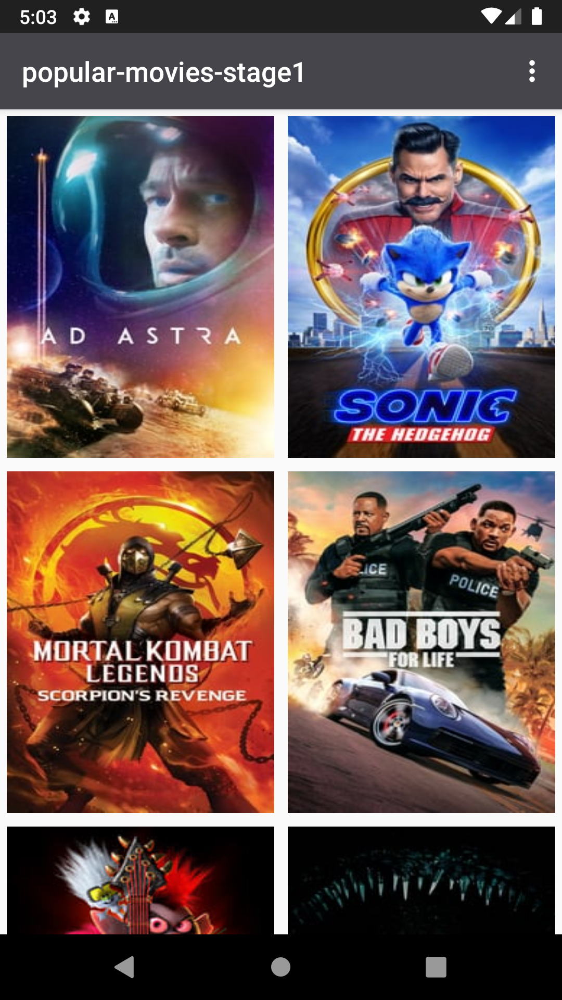
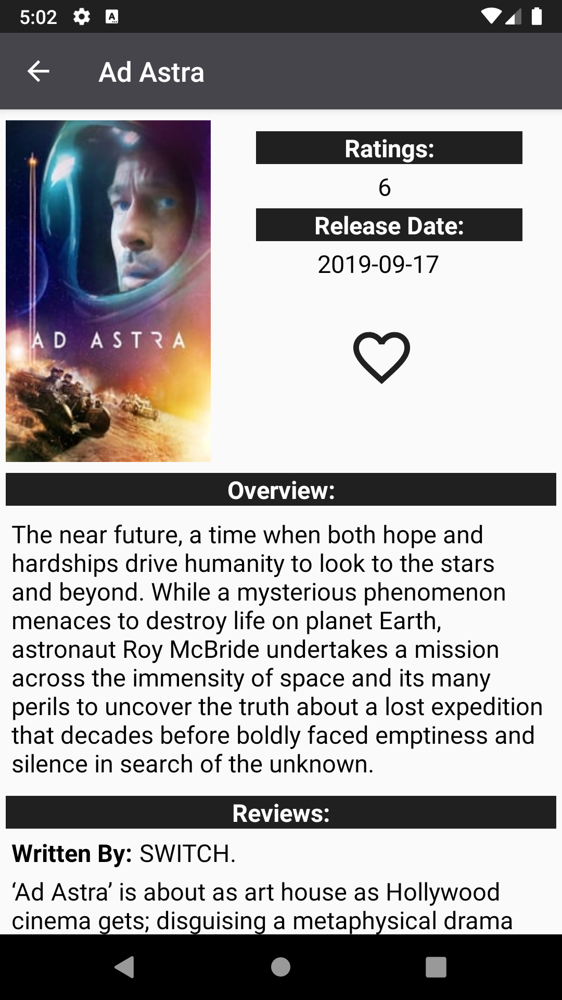
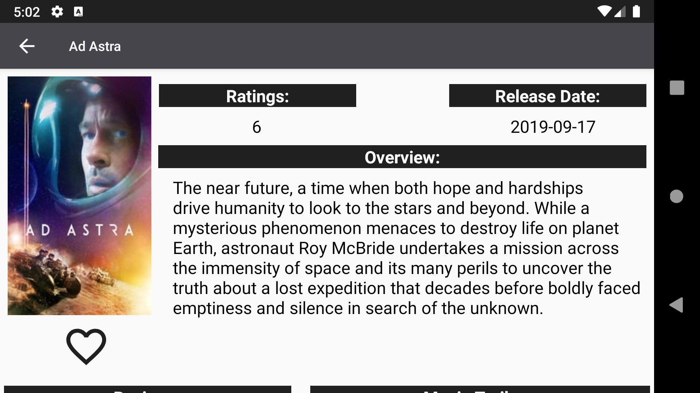
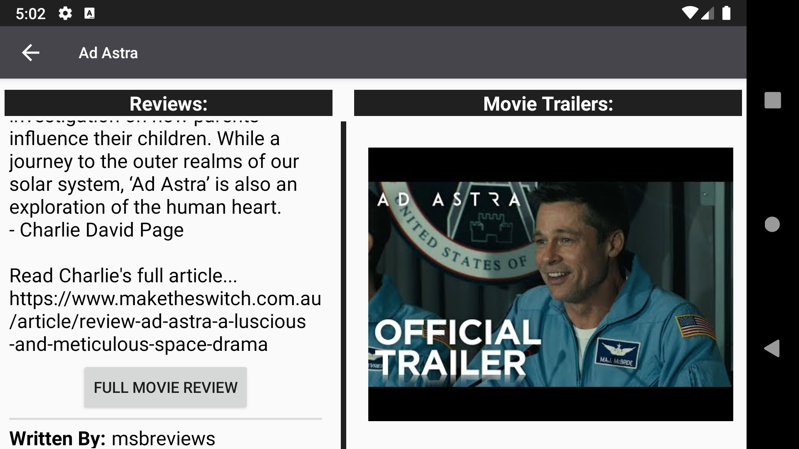

# Popular-Movies-Stage2
Udacity | Android Developer Nanodegree | Project 2: Popular Movies, Stage 2

### Project Overview:
Project Overview
Welcome back to Popular Movies! In this second and final stage, you’ll add additional functionality
to the app you built in Stage 1. This is part 2.

You’ll add more information to your movie details view:
- allow users to view and play trailers (either in the youtube app or a web browser).
- allow users to read reviews of a selected movie.
- also allow users to mark a movie as a favorite in the details view by tapping a button (star).
- make use of Android Architecture Components (Room, LiveData, ViewModel and Lifecycle) to create a robust an efficient application.
- create a database using Room to store the names and ids of the user's favorite movies (and optionally, the rest of the information needed to display their favorites collection while offline).
- modify the existing sorting criteria for the main view to include an additional pivot to show their favorites collection.

### What Will I Learn After Stage 2?
You will build a fully featured application that looks and feels natural on the latest Android operating system.

### Snapshots:
  

  
